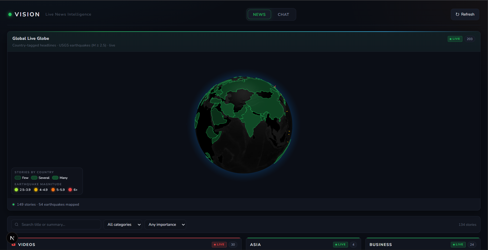
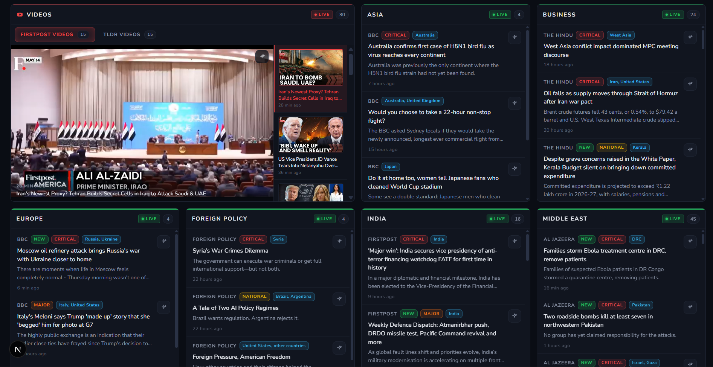
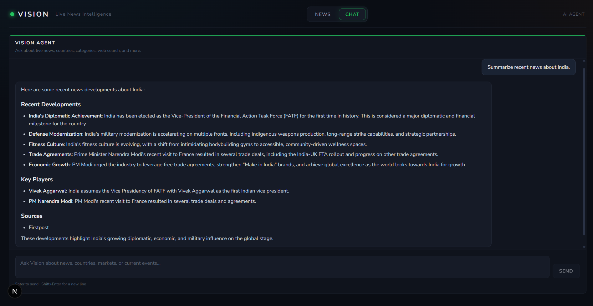

<div align="center">

# VISION

### Live News Intelligence Dashboard

A Jarvis-style situational awareness board — 3D globe, live RSS feeds, earthquake overlays, AI summaries, and a conversational intelligence agent.

<br />

[](https://nextjs.org/)
[](https://react.dev/)
[](https://fastapi.tiangolo.com/)
[](https://www.langchain.com/)
[](https://groq.com/)
[](https://ollama.com/)

<br />

[Features](#-features) · [Screenshots](#-screenshots) · [Quick Start](#-quick-start) · [API](#-api-reference)

</div>

---

## Screenshots

### Global Live Globe — news heatmap & earthquake overlay

<p align="center">
  
</p>

<p align="center">
  <em>Interactive WebGL globe with country-level news density, USGS earthquake markers (M ≥ 2.5), and click-to-filter by country.</em>
</p>

### News Dashboard — live feeds, categories & video panel

<p align="center">
  
</p>

<p align="center">
  <em>Streaming RSS headlines grouped by region and topic — with importance badges, country tags, AI summarize actions, and a live YouTube briefing panel.</em>
</p>

### Vision Agent — ask anything about the world

<p align="center">
  
</p>

<p align="center">
  <em>Conversational AI powered by Groq + LangChain — queries your news database, searches the web, and responds like an intelligence analyst.</em>
</p>

---

## What is Vision?

**Vision** turns passive news browsing into active intelligence. It aggregates headlines from 11 global RSS feeds, enriches each article with AI-derived country tags and importance scores, caches everything in SQLite, and presents it on a cinematic dark-mode dashboard with a spinning 3D Earth.

Switch to the **Chat** tab and ask natural-language questions — *"What are the top stories in India?"*, *"Summarize recent tech news"* — and Vision's LangChain agent pulls from your local news corpus, Exa web search, Wikipedia, arXiv, and Yahoo Finance to deliver structured, evidence-based briefings.

Built for current-affairs enthusiasts, UPSC/general-awareness prep, journalists, and anyone who wants a superhero briefing room on their desktop.

---

## Features

| | |
|---|---|
| **3D Globe Choropleth** | `react-globe.gl` + Three.js map colored by per-country news density; click a country to filter feeds |
| **Live RSS Streaming** | NDJSON stream — cached articles appear instantly, then fresh batches arrive per source |
| **Earthquake Overlay** | USGS GeoJSON (M ≥ 2.5, last 24 h) rendered as glowing markers on the globe |
| **AI Enrichment** | Ollama `phi3` extracts countries + importance (0–5) for articles that need deeper analysis |
| **Smart Filters** | Search, country, category, and minimum-importance filters with live result counts |
| **Article Summaries** | Trafilatura extraction + Groq bulletin-style summaries on demand |
| **Video Briefings** | YouTube RSS carousel with transcript-based AI summaries |
| **Intelligence Agent** | Groq Llama 4 Scout agent with 10 tools, SSE streaming, and a visible tool-call log |
| **24 h SQLite Cache** | Fast reloads, deduplication by URL, importance-sorted queries |

---

## Tech Stack

| Layer | Technologies |
|-------|-------------|
| **Frontend** | Next.js 16 · React 19 · Tailwind CSS 4 · react-globe.gl · Three.js · react-markdown |
| **Backend** | FastAPI · httpx · feedparser · trafilatura · youtube-transcript-api |
| **AI** | Ollama `phi3` (feed enrichment) · Groq (chat & summaries) · LangChain agents · Exa (web search) |
| **Data** | SQLite (`vision.db`) — 24-hour article retention |
| **Sources** | BBC · The Hindu · Al Jazeera · Firstpost · Ars Technica · TechCrunch · Foreign Policy · USGS · YouTube |

---

## Quick Start

### Prerequisites

- **Node.js** 18+ and **npm**
- **Python** 3.11+
- **[Ollama](https://ollama.com/)** running locally with the `phi3` model
- **Groq API key** — [console.groq.com](https://console.groq.com/)
- **Exa API key** (optional, for web search in chat) — [exa.ai](https://exa.ai/)

```bash
ollama pull phi3
```

### 1. Clone & install

```bash
git clone https://github.com/Amar2502/Vision.git
cd Vision

# Backend
cd backend
python -m venv .venv
.venv\Scripts\activate        # Windows
# source .venv/bin/activate   # macOS / Linux
pip install -r requirements.txt

# Frontend
cd ../frontend
npm install
```

### 2. Configure environment

Create `backend/.env`:

```env
GROQ_API_KEY=your_groq_api_key_here
EXA_AI_API_KEY=your_exa_api_key_here   # optional — enables web search tool
```

> **Ollama** handles country/importance enrichment during feed ingestion. **Groq** powers the chat agent and article/video summarization. **Exa** is optional but recommended for live web search in chat.

### 3. Run

**Windows (one-click):**

```bat
start_all.bat
```

Starts the FastAPI backend on `http://localhost:8000`, the Next.js frontend on `http://localhost:3000`, and opens your browser.

**Manual (any OS):**

```bash
# Terminal 1 — backend (Ollama must be running)
cd backend
uvicorn main:app --reload --host 127.0.0.1 --port 8000

# Terminal 2 — frontend
cd frontend
npm run dev
```

Open **http://localhost:3000** in your browser.

---

## Environment Variables

| Variable | Required | Description |
|----------|----------|-------------|
| `GROQ_API_KEY` | Yes | Groq API key for chat agent and summarization endpoints |
| `EXA_AI_API_KEY` | No | Exa API key for the agent's `search_web` tool |

---

## API Reference

| Method | Endpoint | Response | Description |
|--------|----------|----------|-------------|
| `GET` | `/` | JSON | API health / welcome |
| `GET` | `/feeds` | NDJSON stream | Cached articles first, then per-source new batches |
| `GET` | `/earthquakes` | JSON array | USGS earthquakes M ≥ 2.5, last 24 h |
| `GET` | `/videos` | JSON array | Latest videos from configured YouTube channels |
| `POST` | `/summarize` | JSON | Extract & summarize article from URL |
| `POST` | `/videos/summarize` | JSON | Summarize YouTube video from transcript |
| `POST` | `/chat` | SSE stream | LangChain agent — tool events + token stream |

The Next.js dev server proxies all routes to the backend via `next.config.ts` rewrites.

### Feed stream format

```json
{"type": "cached", "feeds": [...]}
{"type": "new", "source": "BBC", "feeds": [...]}
```

### Chat SSE events

`on_tool_start` · `on_tool_end` · `on_chat_model_stream` · `on_chat_model_end` · `error`

---

## AI Agent Tools

Vision's chat agent has access to 10 tools:

| Tool | Source | Purpose |
|------|--------|---------|
| `get_latest_news` | SQLite | Top headlines from the last 24 h |
| `get_latest_news_for_country` | SQLite | Filter by country |
| `get_latest_news_for_category` | SQLite | Filter by category |
| `get_latest_news_for_source` | SQLite | Filter by news outlet |
| `get_latest_news_for_importance` | SQLite | Filter by importance score (0–5) |
| `get_date_and_time` | Local | Current date and time |
| `search_web` | Exa | Live web search with highlights |
| `wiki` | Wikipedia | Background context |
| `arxiv` | arXiv | Research papers |
| `yahoo_finance_news` | Yahoo Finance | Market headlines |

---

## News Sources

**RSS feeds** (11 active):

| Outlet | Categories |
|--------|-----------|
| BBC | World · Asia · Africa · Europe |
| The Hindu | India States · Business |
| Firstpost | India |
| Al Jazeera | Middle East |
| Ars Technica | Science |
| TechCrunch | Technology |
| Foreign Policy | Foreign Policy |

**YouTube channels:** Firstpost · TLDR

---

## Project Structure

```
Vision/
├── start_all.bat              # Windows launcher (backend + frontend + browser)
├── docs/images/               # README screenshots
│
├── backend/
│   ├── main.py                # FastAPI routes
│   ├── models.py              # Pydantic schemas
│   ├── ai/                    # LangChain chat agent
│   │   ├── chat.py            # SSE event stream
│   │   ├── llm.py             # Groq agent setup
│   │   ├── tools.py           # 10 agent tools
│   │   └── systemprompt.py    # Intelligence analyst prompt
│   ├── controllers/           # feeds, earthquakes, videos
│   ├── database/              # SQLite schema & queries
│   ├── ingestion_source/      # RSS & YouTube URL configs
│   └── utils/                 # Country detection, importance scoring
│
└── frontend/
    ├── next.config.ts         # API rewrites → localhost:8000
    ├── public/custom.geo.json # Country boundaries for globe
    └── src/
        ├── app/page.tsx       # Main dashboard (News | Chat tabs)
        └── components/vision/ # Globe, filters, news grid, chat UI
```

---

## Roadmap

- [ ] Conversation memory for multi-turn chat follow-ups
- [ ] Earthquake query tool for the chat agent
- [ ] Daily briefing generator & TTS read-aloud
- [ ] Docker Compose setup (backend + frontend + Ollama)
- [ ] Cross-tab "Ask Vision about this" on news cards
- [ ] Voice input via Web Speech API

---

## Author

Built by **[Amar2502](https://github.com/Amar2502)**

If Vision helps you stay informed, consider giving the repo a star.

---

<div align="center">

**VISION** — *See the world. Understand it.*

</div>
